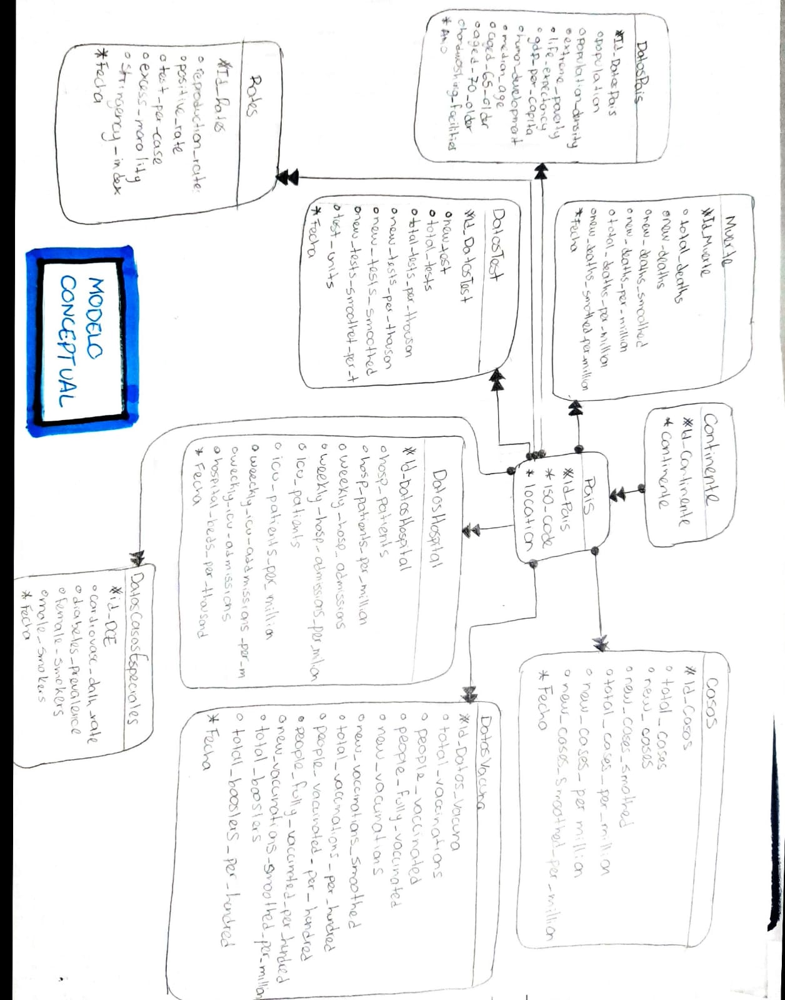

# [BD1]Práctica#1_201801263  Audrie Annelisse del Cid Ochoa


# Marco Teórico
## Bases de Datos
Una base de datos se considera que es un conjunto de datos persistentes utilizados por los sitemas.
También se puede considerar una base de datos como una colección de archivos de datos computarizados la cual puede pertenecer a un sistema. 

En un sistema de Base de datos se pueden encontrar lo siguientes componentes:
- Usuarios
- Datos
- Software
- Hardware

En dicho sistema los usuarios pueden:
- Agregar nuevos archivos vacíos a la base de datos.
- Insertar datos dentro de los archivos existentes.
- Recuperar datos de los archivos existentes.
- Modificar datos en archivos existentes.
- Eliminar datos de los archivos existentes.
- Eliminar archivos existentes de la base de datos.

Pero para que el usuario pueda realizar todas estas acciones mencionadas anteriormente y en sí que todo el sistema funcione, se tiene que pasar por un proceso conocido como "Proceso de Desarrollo de Bases de Datos", el cual se explicará más adelante.

## Proceso de Desarrollo de Bases de Datos
Consiste en definir la estructura lógica y física de una o más bases de datos para responder a las necesidades de los usuarios con respecto a la información que necesita un sistema de información.

En otras palabras, es el proceso en el que se define la estructura de los datos que debe tener la base de datos de un sistema de información determinado y cómo se deben almacenar y gestionar estos datos para permitir una explotación eficiente de los mismos por los sistemas de información.

Para este proceso existen 3 tipos de modelo, los cuales son los siguientes:

- Modelo de Datos Conceptual
- Modelo de Datos Conceptual Lógico
- Modelo de Datos Físico

### Modelo de Datos Conceptaul
Los requisitos de datos se registran inicialmente como un modelo de datos conceptual que es esencialmente un conjunto de especificaciones tecnológicas independientes y se utiliza para representar las reglas del negocio.

### Modelo de datos Lógico
El modelo conceptual se traduce luego en un modelo de datos lógico, que documenta las estructuras de los datos que se pueden implementar en las bases de datos. La implementación de un modelo de datos conceptual puede requerir múltiples modelos de datos lógicos.

### Modelo Físico
El último paso en el modelado de datos es transformar el modelo de datos lógico en un modelo de datos físico que organice los datos en una base de datos y que tenga en cuenta los detalles de acceso, rendimiento y almacenamiento. Este es dependiente del software y del hardware.


---

# Modelo Conceptual

|               |
| :----------------------------------------------------------: |

> ## Bachmann
|               |
| :----------------------------------------------------------: |

> ## Peter Chen
|               |
| :----------------------------------------------------------: |
<br/>

### Entidad Continente
La entidad CONTINENTE se creó debido a que dentro de los datos brindados el continente era una forma de clasificación para la entidad que conforma datos realcionados al país. Esta entidad tiene una relación de uno a muchos con la entidad PAIS. Los atributos para esta entidad son los siguientes.

- id_Continente: Llave Primaria, permite identificar el continente.
- continent: Este dato contiene el nombre del Continente, no puede ser nulo.

### Entidad Pais
La entidad PAIS se creó debido a que dentro de los datos brindados clasificaban con ciertos atributos referentes a un país, los demás datos. Esta entidad tiene una relación de uno a muchos con varias entidades como Muertes, DatosPais, DatosTest, Rates, DatosCasosEspeciales, DatosHospital, Casos y DatosVacuna. Los atributos para esta entidad son los siguientes.

- id_Pais: Llave primaria, permite identificar al país
- iso_code: Atributo único. Codigo que identifica al País.
- location
- id_Continente: Clasifica a los países por continente.

### Entidad Muerte
La entidad MUERTE se creó debido a que dentro de los datos brindados existían aquellos que mostraban cifras totales de muerte respecto al virus Covid-19. Esta entidad tiene una relación de uno a muchos con la entidad País, debido a que dicha entidad puede tener diferentes datos de la entidad Muerte dependiendo de la fecha. Esta entidad consta de los siguientes atributos.

- id_Muertes: Llave primaria, permite identificar los datos de la entidad Muerte.
- total_deaths: Es la cifra total de muertos a la fecha.
- new_deaths: Número que indica la nueva cantidad de muertos registrados después del último registro.
- new_deaths_smoothed
- total_deaths_per_million
- new_deaths_per_million
- new_deaths_smoothed_per_million
- Fecha: Esta indica la fecha en la que fue realizado el registro. Es de caracter obligatorio.
- id_Pais: Llave foranea, permite relacionar la entidad Pais con la entidad Muerte mediante el id del País.

### Entidad Caso
La entidad CASO se creó debido a que dentro de los datos brindados existían aquellos que mostraban cifras totales de casos confirmados respecto al virus Covid-19. Esta entidad tiene una relación de uno a muchos con la entidad País, debido a que dicha entidad puede tener diferentes datos de la entidad CASO dependiendo de la fecha. Esta entidad consta de los siguientes atributos.

- id_Casos: Llave primaria, permite identificar los datos de la entidad Caso.
- total_deaths: Es la cifra total de casos a la fecha.
- new_deaths: Número que indica la nueva cantidad de casos registrados después del último registro.
- new_cases_smoothed
- total_cases_per_million
- new_cases_per_million
- new_cases_smoothed_per_million
- Fecha: Esta indica la fecha en la que fue realizado el registro. Es de caracter obligatorio.
- id_Pais: Llave foranea, permite relacionar la entidad Pais con la entidad Caso mediante el id del País.

### Entidad DatosHospital
La entidad DatosHospital se creó debido a que dentro de los datos brindados existían aquellos que mostraban cifras totales de pasientes confirmados respecto al virus Covid-19. Esta entidad tiene una relación de uno a muchos con la entidad País, debido a que dicha entidad puede tener diferentes datos de la entidad DatosHospital dependiendo de la fecha. Esta entidad consta de los siguientes atributos.

- id_DatosHopital: Llave primaria, permite identificar los datos de la entidad DatosHospital.
- hosp_patients: Es la cifra total de pacientes a la fecha.
- hosp_patients_per_million
- weekly_hsp_admissions
- weekly_hosp_admissions_per_million
- icu_patients
- icu_patients_per_million
- weeckly_icu_addmissions_per_million
- weekly_icu_admissions
- hospital_beds_per_thousand
- Fecha: Esta indica la fecha en la que fue realizado el registro. Es de caracter obligatorio.
- id_Pais: Llave foranea, permite relacionar la entidad Pais con la entidad Caso mediante el id del País.

### Entidad DatosPais
La entidad DatosPais se creó debido a que dentro de los datos brindados existían varios que mostraban cierta información del país, variando por año. Esta entidad tiene una relación de uno a muchos con la entidad País, debido a que dicha entidad puede tener diferentes datos de la entidad DatosPais dependiendo del año. Esta entidad consta de los siguientes atributos.

- id_DatosPais: Llave primaria, permite identificar los datos de la entidad.
- population: Contiene la información de la cantidad de población que hay en el país.
- population_density
- extreme_poverty
- life_expectancy: Contiene información de la esperanza de vida del País.
- gdp_per_capita
- human_development_index
- median_age
- aged_65_older
- aged_70_older
- hanwashing_facilities
- Año: Esta indica el año en la que fue realizado el registro dado que dichos datos no varían por fecha, sino que por año. Es de caracter obligatorio.
- id_Pais: Llave foranea, permite relacionar la entidad Pais con la entidad DatosPais mediante el id del País.


### Entidad DatosTest
La entidad DatosTest se creó debido a que dentro de los datos brindados existían varios que mostraban cierta información de las pruebas realizadas en el país para detectar el virus Covid-19. Esta entidad tiene una relación de uno a muchos con la entidad País, debido a que dicha entidad puede tener diferentes datos de la entidad DatosTest dependiendo de la Fecha. Esta entidad consta de los siguientes atributos.

- id_DatosTest: Llave primaria, permite identificar los datos de la entidad.
- new_test: Muestra la cantidad de nuevas pruebas realizadas respecto al último dato registrado.
- total_tests: Muestra el total de pruebas realizadas en el país.
- total_tests_per_thousan
- new_tests_per_thousan
- new_tests_smoothed
- new_tests_smoothet_per_thousan
- test_units
- Fecha: Esta indica la fecha en la que fue realizada el registro. Es de caracter obligatorio.
- id_Pais: Llave foranea, permite relacionar la entidad Pais con la entidad DatosPais mediante el id del País.

### Entidad Rates
La entidad Rates se creó debido a que dentro de los datos brindados existían varios que mostraban cierta información respecto a índices o porcentajes de ciertos datos variados en el país. Esta entidad tiene una relación de uno a muchos con la entidad País, debido a que dicha entidad puede tener diferentes datos de la entidad Rates dependiendo de la Fecha. Esta entidad consta de los siguientes atributos.

- id_Rates: Llave primaria, permite identificar los datos de la entidad.
- new_testreproduction_rate
- positive_rate
- test_per_case
- excess_mortality
- strigency_index
- Fecha: Esta indica la fecha en la que fue realizada el registro. Es de caracter obligatorio.
- id_Pais: Llave foranea, permite relacionar la entidad Pais con la entidad Rates mediante el id del País.


### Entidad DatosEspeciales
La entidad DatosEspeciales se creó debido a que dentro de los datos brindados existían varios que mostraban cierta información respecto a casos especiales respecto a salud o costumbres perjudiciales para la salud en el país. Esta entidad tiene una relación de uno a muchos con la entidad País, debido a que dicha entidad puede tener diferentes datos de la entidad DatosEspeciales dependiendo de la Fecha. Esta entidad consta de los siguientes atributos.

- id_DCE: Llave primaria, permite identificar los datos de la entidad.
- cardiovasc_dat_rate
- diabetes_prevalence
- female_smokers
- male_smokers
- Fecha: Esta indica la fecha en la que fue realizada el registro. Es de caracter obligatorio.
- id_Pais: Llave foranea, permite relacionar la entidad Pais con la entidad DatosEspeciales mediante el id del País.

### Entidad DatosVacuna
La entidad DatosEspeciales se creó debido a que dentro de los datos brindados existían varios que mostraban cierta información respecto al suministro de vacunas en el país. Esta entidad tiene una relación de uno a muchos con la entidad País, debido a que dicha entidad puede tener diferentes datos de la entidad DatosEspeciales dependiendo de la Fecha. Esta entidad consta de los siguientes atributos.

- id_DatosVacuna: Llave primaria, permite identificar los datos de la entidad.
- total_vaccinations:Muestra el total de personas vacunadas con la primera dosis
- people vaccinated
- people_fully_vaccinated
- new_vaccinated
- new_vaccinations_per_hundred
- people_vaccinated_per_hundred
- people_fully_vaccinated_per_hundred
- new_vaccinations_smoothed_per_million
- total_boosters: Cantidad total de refuerso aplicados.
- total_boosters_per_hundred
- Fecha: Esta indica la fecha en la que fue realizada el registro. Es de caracter obligatorio.
- id_Pais: Llave foranea, permite relacionar la entidad Pais con la entidad DatosVacuna mediante el id del País.

# Modelo Lógico

<table class="tg" >
<thead>
  <tr>
    <th colspan="3">CONTINENTE</th>
  </tr>
</thead>
<tbody>
  <tr>
    <td class="tg-0pky">Columnas</td>
    <td class="tg-0pky">id_Contienente</td>
    <td class="tg-0lax">continent</td>
  </tr>
  <tr>
    <td class="tg-0pky">Restricciones</td>
    <td class="tg-0pky">PK</td>
    <td class="tg-0lax">NN</td>
  </tr>
  <tr>
    <td class="tg-0pky">1</td>
    <td class="tg-0pky">1</td>
    <td class="tg-0lax">Asia</td>
  </tr>
  <tr>
    <td class="tg-0pky">1</td>
    <td class="tg-0pky">2</td>
    <td class="tg-0lax">Europe</td>
  </tr>
  <tr>
    <td class="tg-0pky">2</td>
    <td class="tg-0pky">3</td>
    <td class="tg-0lax">Africa</td>
  </tr>
</tbody>
</table>


<table class="tg">
<thead>
  <tr>
    <th class="tg-c3ow" colspan="5">PAIS</th>
  </tr>
</thead>
<tbody>
  <tr>
    <td class="tg-0pky">Columnas</td>
    <td class="tg-0pky">id_Pais</td>
    <td class="tg-0lax">iso_code</td>
    <td class="tg-0lax">location</td>
    <td class="tg-0lax">id_Continente</td>
  </tr>
  <tr>
    <td class="tg-0pky">Restricciones</td>
    <td class="tg-0pky">PK</td>
    <td class="tg-0lax"> U NN</td>
    <td class="tg-0lax">NN</td>
    <td class="tg-0lax">FK NN</td>
  </tr>
  <tr>
    <td class="tg-0pky">1</td>
    <td class="tg-0pky">1</td>
    <td class="tg-0lax">AFG</td>
    <td class="tg-0lax">Afghanista</td>
    <td class="tg-0lax">1</td>
  </tr>
  <tr>
    <td class="tg-0pky">2</td>
    <td class="tg-0pky">2</td>
    <td class="tg-0lax">ALB</td>
    <td class="tg-0lax">Albania</td>
    <td class="tg-0lax">2</td>
  </tr>
  <tr>
    <td class="tg-0pky">3</td>
    <td class="tg-0pky">3</td>
    <td class="tg-0lax">OWID_AFR</td>
    <td class="tg-0lax">Africa</td>
    <td class="tg-0lax">3</td>
  </tr>
</tbody>
</table>


<table class="tg">
<thead>
  <tr>
    <th class="tg-c3ow" colspan="10">MUERTE</th>
  </tr>
</thead>
<tbody>
  <tr>
    <td class="tg-0pky">Columnas</td>
    <td class="tg-0pky">id_Muertes</td>
    <td class="tg-0pky">total_deaths</td>
    <td class="tg-0pky">new_deaths</td>
    <td class="tg-0pky">new_deaths_smoothed</td>
    <td class="tg-0lax">total_deaths_per_million</td>
    <td class="tg-0pky">new_deaths_per_million</td>
    <td class="tg-0lax">new_deaths_smoothed_per_million</td>
    <td class="tg-0lax">Fecha</td>
    <td class="tg-0lax">id_Pais</td>
  </tr>
  <tr>
    <td class="tg-0pky">Restricciones</td>
    <td class="tg-0pky">PK</td>
    <td class="tg-0pky"></td>
    <td class="tg-0pky"></td>
    <td class="tg-0pky"></td>
    <td class="tg-0lax"></td>
    <td class="tg-0pky"></td>
    <td class="tg-0lax"></td>
    <td class="tg-0lax">NN</td>
    <td class="tg-0lax">FK NN</td>
  </tr>
  <tr>
    <td class="tg-0pky">1</td>
    <td class="tg-0pky">1</td>
    <td class="tg-0pky"></td>
    <td class="tg-0pky"></td>
    <td class="tg-0pky"></td>
    <td class="tg-0lax"></td>
    <td class="tg-0pky"></td>
    <td class="tg-0lax"></td>
    <td class="tg-0lax">24/02/2020</td>
    <td class="tg-0lax">1</td>
  </tr>
  <tr>
    <td class="tg-0pky">2</td>
    <td class="tg-0pky">2</td>
    <td class="tg-0pky">300540</td>
    <td class="tg-0pky">2420</td>
    <td class="tg-0pky">252286</td>
    <td class="tg-0lax">21882</td>
    <td class="tg-0pky">176</td>
    <td class="tg-0lax">184</td>
    <td class="tg-0lax">01/09/2020</td>
    <td class="tg-0lax">2</td>
  </tr>
  <tr>
    <td class="tg-0pky">3</td>
    <td class="tg-0pky">3</td>
    <td class="tg-0pky">4690</td>
    <td class="tg-0pky">40</td>
    <td class="tg-0pky">3714</td>
    <td class="tg-0lax">102185</td>
    <td class="tg-0pky">1392</td>
    <td class="tg-0lax">1293</td>
    <td class="tg-0lax">23/10/2020</td>
    <td class="tg-0lax">3</td>
  </tr>
</tbody>
</table>


<table class="tg">
<thead>
  <tr>
    <th class="tg-c3ow" colspan="10">CASO</th>
  </tr>
</thead>
<tbody>
  <tr>
    <td class="tg-0pky">Columnas</td>
    <td class="tg-0pky">id_Casos</td>
    <td class="tg-0pky">total_cases</td>
    <td class="tg-0pky">new_cases</td>
    <td class="tg-0pky">new_cases_smoothed</td>
    <td class="tg-0pky">total_cases_per_million</td>
    <td class="tg-0pky">new_cases_per_million</td>
    <td class="tg-0pky">new_cases_smoothed_per_million</td>
    <td class="tg-0pky">Fecha</td>
    <td class="tg-0pky">id_Pais</td>
  </tr>
  <tr>
    <td class="tg-0pky">Restricciones</td>
    <td class="tg-0pky">PK</td>
    <td class="tg-0pky"></td>
    <td class="tg-0pky"></td>
    <td class="tg-0pky"></td>
    <td class="tg-0pky"></td>
    <td class="tg-0pky"></td>
    <td class="tg-0pky"></td>
    <td class="tg-0pky">NN</td>
    <td class="tg-0pky">FK NN</td>
  </tr>
  <tr>
    <td class="tg-0pky">1</td>
    <td class="tg-0pky">1</td>
    <td class="tg-0pky">10</td>
    <td class="tg-0pky">10</td>
    <td class="tg-0pky"> </td>
    <td class="tg-0pky">25</td>
    <td class="tg-0pky">25</td>
    <td class="tg-0pky"> </td>
    <td class="tg-0pky">24/02/2020</td>
    <td class="tg-0pky">1</td>
  </tr>
  <tr>
    <td class="tg-0pky">2</td>
    <td class="tg-0pky">2</td>
    <td class="tg-0pky">12593920</td>
    <td class="tg-0pky">71580</td>
    <td class="tg-0pky">8045286</td>
    <td class="tg-0pky">916931</td>
    <td class="tg-0pky">5212</td>
    <td class="tg-0pky">5858</td>
    <td class="tg-0pky">01/09/2020</td>
    <td class="tg-0pky">2</td>
  </tr>
  <tr>
    <td class="tg-0pky">3</td>
    <td class="tg-0pky">3</td>
    <td class="tg-0pky">185560</td>
    <td class="tg-0pky">3060</td>
    <td class="tg-0pky">293571</td>
    <td class="tg-0pky">6458902</td>
    <td class="tg-0pky">106511</td>
    <td class="tg-0pky">102185</td>
    <td class="tg-0pky">23/10/2020</td>
    <td class="tg-0pky">3</td>
  </tr>
</tbody>
</table>


<table class="tg">
<thead>
  <tr>
    <th class="tg-c3ow" colspan="13">DATOSHOSPITAL</th>
  </tr>
</thead>
<tbody>
  <tr>
    <td class="tg-0pky">Columnas</td>
    <td class="tg-0pky">id_DatosHospital</td>
    <td class="tg-0pky">hosp_patients</td>
    <td class="tg-0pky">hosp_patients_per_million</td>
    <td class="tg-0pky">weekly_hosp_admissions</td>
    <td class="tg-0pky">weeekly_hosp_addmissions_per_million</td>
    <td class="tg-0pky">icu_patients</td>
    <td class="tg-0pky">icu_patients_per_million</td>
    <td class="tg-0pky">weekly_icu_addmissions_per_million</td>
    <td class="tg-0pky">weekly_icu_addmisions</td>
    <td class="tg-0lax">hospital_beds_per_thousand</td>
    <td class="tg-0lax">Fecha</td>
    <td class="tg-0lax">id_Pais</td>
  </tr>
  <tr>
    <td class="tg-0pky">Restricciones</td>
    <td class="tg-0pky">PK</td>
    <td class="tg-0pky"></td>
    <td class="tg-0pky"></td>
    <td class="tg-0pky"></td>
    <td class="tg-0pky"></td>
    <td class="tg-0pky"></td>
    <td class="tg-0pky"></td>
    <td class="tg-0pky"></td>
    <td class="tg-0pky"></td>
    <td class="tg-0lax"></td>
    <td class="tg-0lax">NN</td>
    <td class="tg-0lax">FK NN</td>
  </tr>
  <tr>
    <td class="tg-0pky">1</td>
    <td class="tg-0pky">1</td>
    <td class="tg-0pky"> </td>
    <td class="tg-0pky"></td>
    <td class="tg-0pky"></td>
    <td class="tg-0pky"></td>
    <td class="tg-0pky"></td>
    <td class="tg-0pky"></td>
    <td class="tg-0pky"></td>
    <td class="tg-0pky"></td>
    <td class="tg-0lax">5</td>
    <td class="tg-0lax">24/02/2020</td>
    <td class="tg-0lax">1</td>
  </tr>
  <tr>
    <td class="tg-0pky">2</td>
    <td class="tg-0pky">2</td>
    <td class="tg-0pky"> </td>
    <td class="tg-0pky"></td>
    <td class="tg-0pky"></td>
    <td class="tg-0pky"></td>
    <td class="tg-0pky"></td>
    <td class="tg-0pky"></td>
    <td class="tg-0pky"></td>
    <td class="tg-0pky"></td>
    <td class="tg-0lax"> </td>
    <td class="tg-0lax">01/09/2020</td>
    <td class="tg-0lax">2</td>
  </tr>
  <tr>
    <td class="tg-0pky">3</td>
    <td class="tg-0pky">3</td>
    <td class="tg-0pky"> </td>
    <td class="tg-0pky"></td>
    <td class="tg-0pky"></td>
    <td class="tg-0pky"></td>
    <td class="tg-0pky"></td>
    <td class="tg-0pky"></td>
    <td class="tg-0pky"></td>
    <td class="tg-0pky"></td>
    <td class="tg-0lax">289</td>
    <td class="tg-0lax">23/10/2020</td>
    <td class="tg-0lax">3</td>
  </tr>
</tbody>
</table>


<table class="tg">
<thead>
  <tr>
    <th class="tg-c3ow" colspan="13">DATOSPAIS</th>
    <th class="tg-0lax"></th>
  </tr>
</thead>
<tbody>
  <tr>
    <td class="tg-0pky">Columnas</td>
    <td class="tg-0pky">id_DatosPais</td>
    <td class="tg-0pky">population</td>
    <td class="tg-0pky">population_density</td>
    <td class="tg-0pky">extreme_poverty</td>
    <td class="tg-0pky">life_expectancy</td>
    <td class="tg-0pky">gdp_per_capita</td>
    <td class="tg-0pky">human_development_index</td>
    <td class="tg-0pky">median_age</td>
    <td class="tg-0pky">aged_65_older</td>
    <td class="tg-0lax">age_70_older</td>
    <td class="tg-0lax">handwashing_facilities</td>
    <td class="tg-0lax">Anio</td>
    <td class="tg-0lax">id_Pais</td>
  </tr>
  <tr>
    <td class="tg-0pky">Restricciones</td>
    <td class="tg-0pky">PK</td>
    <td class="tg-0pky"></td>
    <td class="tg-0pky"></td>
    <td class="tg-0pky"></td>
    <td class="tg-0pky"></td>
    <td class="tg-0pky"></td>
    <td class="tg-0pky"></td>
    <td class="tg-0pky"></td>
    <td class="tg-0pky"></td>
    <td class="tg-0lax"></td>
    <td class="tg-0lax"></td>
    <td class="tg-0lax">NN</td>
    <td class="tg-0lax">FK NN</td>
  </tr>
  <tr>
    <td class="tg-0pky">1</td>
    <td class="tg-0pky">1</td>
    <td class="tg-0pky">398354280</td>
    <td class="tg-0pky">54422</td>
    <td class="tg-0pky"> </td>
    <td class="tg-0pky">6483</td>
    <td class="tg-0pky">1803987</td>
    <td class="tg-0pky">511</td>
    <td class="tg-0pky">186</td>
    <td class="tg-0pky">2581</td>
    <td class="tg-0lax">1337</td>
    <td class="tg-0lax">37746</td>
    <td class="tg-0lax">24/02/2020</td>
    <td class="tg-0lax">1</td>
  </tr>
  <tr>
    <td class="tg-0pky">2</td>
    <td class="tg-0pky">2</td>
    <td class="tg-0pky">137350000000000</td>
    <td class="tg-0pky"> </td>
    <td class="tg-0pky"> </td>
    <td class="tg-0pky"> </td>
    <td class="tg-0pky"> </td>
    <td class="tg-0pky"> </td>
    <td class="tg-0pky"> </td>
    <td class="tg-0pky"> </td>
    <td class="tg-0lax"> </td>
    <td class="tg-0lax"> </td>
    <td class="tg-0lax">01/09/2020</td>
    <td class="tg-0lax">2</td>
  </tr>
  <tr>
    <td class="tg-0pky">3</td>
    <td class="tg-0pky">3</td>
    <td class="tg-0pky">28729340</td>
    <td class="tg-0pky">104871</td>
    <td class="tg-0pky">1.1</td>
    <td class="tg-0pky">7857</td>
    <td class="tg-0pky">11803431</td>
    <td class="tg-0pky">795</td>
    <td class="tg-0pky">380</td>
    <td class="tg-0pky">13188</td>
    <td class="tg-0lax">8643</td>
    <td class="tg-0lax"> </td>
    <td class="tg-0lax">23/10/2020</td>
    <td class="tg-0lax">3</td>
  </tr>
</tbody>
</table>


<table class="tg">
<thead>
  <tr>
    <th class="tg-c3ow" colspan="11">DATOSTEST</th>
  </tr>
</thead>
<tbody>
  <tr>
    <td class="tg-0pky">Columnas</td>
    <td class="tg-0pky">id_DatosTest</td>
    <td class="tg-0pky">new_test</td>
    <td class="tg-0pky">total_tests</td>
    <td class="tg-0pky">total_tests_per_thousan</td>
    <td class="tg-0pky">new_tests_per_thousan</td>
    <td class="tg-0pky">new_tests_smoothed</td>
    <td class="tg-0pky">new_tests_smmothed_per_thousan</td>
    <td class="tg-0pky">test_units</td>
    <td class="tg-0pky">Fecha</td>
    <td class="tg-0lax">id_Pais</td>
  </tr>
  <tr>
    <td class="tg-0pky">Restricciones</td>
    <td class="tg-0pky">PK</td>
    <td class="tg-0pky"></td>
    <td class="tg-0pky"></td>
    <td class="tg-0pky"></td>
    <td class="tg-0pky"></td>
    <td class="tg-0pky"></td>
    <td class="tg-0pky"></td>
    <td class="tg-0pky"></td>
    <td class="tg-0pky">NN</td>
    <td class="tg-0lax">FK NN</td>
  </tr>
  <tr>
    <td class="tg-0pky">1</td>
    <td class="tg-0pky">1</td>
    <td class="tg-0pky"> </td>
    <td class="tg-0pky"> </td>
    <td class="tg-0pky"> </td>
    <td class="tg-0pky"> </td>
    <td class="tg-0pky"> </td>
    <td class="tg-0pky"> </td>
    <td class="tg-0pky"> </td>
    <td class="tg-0pky">24/02/2020</td>
    <td class="tg-0lax">1</td>
  </tr>
  <tr>
    <td class="tg-0pky">2</td>
    <td class="tg-0pky">2</td>
    <td class="tg-0pky"> </td>
    <td class="tg-0pky"> </td>
    <td class="tg-0pky"> </td>
    <td class="tg-0pky"> </td>
    <td class="tg-0pky"> </td>
    <td class="tg-0pky"> </td>
    <td class="tg-0pky"></td>
    <td class="tg-0pky">01/09/2020</td>
    <td class="tg-0lax">2</td>
  </tr>
  <tr>
    <td class="tg-0pky">3</td>
    <td class="tg-0pky">3</td>
    <td class="tg-0pky">1412.0</td>
    <td class="tg-0pky">1099912.0</td>
    <td class="tg-0pky">38.258</td>
    <td class="tg-0pky">0.491</td>
    <td class="tg-0pky">1368.0</td>
    <td class="tg-0pky">0.476</td>
    <td class="tg-0pky"></td>
    <td class="tg-0pky">23/10/2020</td>
    <td class="tg-0lax">3</td>
  </tr>
</tbody>
</table>


<table class="tg">
<thead>
  <tr>
    <th class="tg-c3ow" colspan="9">RATES</th>
  </tr>
</thead>
<tbody>
  <tr>
    <td class="tg-0pky">Columnas</td>
    <td class="tg-0pky">idRates</td>
    <td class="tg-0pky">new_testresproduction_rate</td>
    <td class="tg-0pky">postive_rate</td>
    <td class="tg-0pky">test_per_case</td>
    <td class="tg-0pky">excess_morality</td>
    <td class="tg-0pky">strigency_index</td>
    <td class="tg-0pky">Fecha</td>
    <td class="tg-0lax">id_Pais</td>
  </tr>
  <tr>
    <td class="tg-0pky">Restricciones</td>
    <td class="tg-0pky">PK</td>
    <td class="tg-0pky"></td>
    <td class="tg-0pky"></td>
    <td class="tg-0pky"></td>
    <td class="tg-0pky"></td>
    <td class="tg-0pky"></td>
    <td class="tg-0pky">NN</td>
    <td class="tg-0lax">FK NN</td>
  </tr>
  <tr>
    <td class="tg-0pky">1</td>
    <td class="tg-0pky">1</td>
    <td class="tg-0pky"> </td>
    <td class="tg-0pky"> </td>
    <td class="tg-0pky"> </td>
    <td class="tg-0pky"> </td>
    <td class="tg-0pky">833</td>
    <td class="tg-0pky">24/02/2020</td>
    <td class="tg-0lax">1</td>
  </tr>
  <tr>
    <td class="tg-0pky">2</td>
    <td class="tg-0pky">2</td>
    <td class="tg-0pky"> </td>
    <td class="tg-0pky"> </td>
    <td class="tg-0pky"> </td>
    <td class="tg-0pky"> </td>
    <td class="tg-0pky"> </td>
    <td class="tg-0pky">01/09/2020</td>
    <td class="tg-0lax">2</td>
  </tr>
  <tr>
    <td class="tg-0pky">3</td>
    <td class="tg-0pky">3</td>
    <td class="tg-0pky"> </td>
    <td class="tg-0pky">0.215</td>
    <td class="tg-0pky">4.7</td>
    <td class="tg-0pky"> </td>
    <td class="tg-0pky">5463</td>
    <td class="tg-0pky">23/10/2020</td>
    <td class="tg-0lax">3</td>
  </tr>
</tbody>
</table>


<table class="tg">
<thead>
  <tr>
    <th class="tg-c3ow" colspan="8">DATOSCASOSESPECIALES</th>
  </tr>
</thead>
<tbody>
  <tr>
    <td class="tg-0pky">Columnas</td>
    <td class="tg-0pky">id_DCE</td>
    <td class="tg-0pky">cardiovasc_dath_rate</td>
    <td class="tg-0pky">diabetes_prevalence</td>
    <td class="tg-0pky">female_smokers</td>
    <td class="tg-0pky">male_smokers</td>
    <td class="tg-0pky">Fecha</td>
    <td class="tg-0lax">id_Pais</td>
  </tr>
  <tr>
    <td class="tg-0pky">Restricciones</td>
    <td class="tg-0pky">PK</td>
    <td class="tg-0pky"></td>
    <td class="tg-0pky"></td>
    <td class="tg-0pky"></td>
    <td class="tg-0pky"></td>
    <td class="tg-0pky">NN</td>
    <td class="tg-0lax">FK NN</td>
  </tr>
  <tr>
    <td class="tg-0pky">1</td>
    <td class="tg-0pky">1</td>
    <td class="tg-0pky">597029</td>
    <td class="tg-0pky">959</td>
    <td class="tg-0pky"> </td>
    <td class="tg-0pky"></td>
    <td class="tg-0pky">24/02/2020</td>
    <td class="tg-0lax">1</td>
  </tr>
  <tr>
    <td class="tg-0pky">2</td>
    <td class="tg-0pky">2</td>
    <td class="tg-0pky"> </td>
    <td class="tg-0pky"> </td>
    <td class="tg-0pky"> </td>
    <td class="tg-0pky"></td>
    <td class="tg-0pky">01/09/2020</td>
    <td class="tg-0lax">2</td>
  </tr>
  <tr>
    <td class="tg-0pky">3</td>
    <td class="tg-0pky">3</td>
    <td class="tg-0pky">304195</td>
    <td class="tg-0pky">1008</td>
    <td class="tg-0pky">7.1</td>
    <td class="tg-0pky">51.2</td>
    <td class="tg-0pky">23/10/2020</td>
    <td class="tg-0lax">3</td>
  </tr>
</tbody>
</table>


<table class="tg">
<thead>
  <tr>
    <th class="tg-c3ow" colspan="14">DATOSVACUNA</th>
  </tr>
</thead>
<tbody>
  <tr>
    <td class="tg-0pky">Columnas</td>
    <td class="tg-0pky">id_DatosVacuna</td>
    <td class="tg-0pky">total_vaccinations</td>
    <td class="tg-0pky">people_fully_vaccinated</td>
    <td class="tg-0pky">new_vaccinations</td>
    <td class="tg-0pky">new_vaccinations_smoothed</td>
    <td class="tg-0lax">total_vaccinations_per_hundred</td>
    <td class="tg-0lax">people_vaccinated_per_hundred</td>
    <td class="tg-0lax">people_fully_vaccuinated_per_hundred</td>
    <td class="tg-0lax">new_vaccinations_smoothed_per_million</td>
    <td class="tg-0lax">total_boosters</td>
    <td class="tg-0lax">total_bossters_per_hundred</td>
    <td class="tg-0pky">Fecha</td>
    <td class="tg-0pky">id_Pais</td>
  </tr>
  <tr>
    <td class="tg-0pky">Restricciones</td>
    <td class="tg-0pky">PK</td>
    <td class="tg-0pky"></td>
    <td class="tg-0pky"></td>
    <td class="tg-0pky"></td>
    <td class="tg-0pky"></td>
    <td class="tg-0lax"></td>
    <td class="tg-0lax"></td>
    <td class="tg-0lax"></td>
    <td class="tg-0lax"></td>
    <td class="tg-0lax"></td>
    <td class="tg-0lax"></td>
    <td class="tg-0pky">NN</td>
    <td class="tg-0pky">FK NN</td>
  </tr>
  <tr>
    <td class="tg-0pky">1</td>
    <td class="tg-0pky">1</td>
    <td class="tg-0pky"></td>
    <td class="tg-0pky"></td>
    <td class="tg-0pky"></td>
    <td class="tg-0pky"></td>
    <td class="tg-0lax"></td>
    <td class="tg-0lax"></td>
    <td class="tg-0lax"></td>
    <td class="tg-0lax"></td>
    <td class="tg-0lax"></td>
    <td class="tg-0lax"></td>
    <td class="tg-0pky">24/02/2020</td>
    <td class="tg-0pky">1</td>
  </tr>
  <tr>
    <td class="tg-0lax">2</td>
    <td class="tg-0lax">2</td>
    <td class="tg-0lax"></td>
    <td class="tg-0lax"></td>
    <td class="tg-0lax"></td>
    <td class="tg-0lax"></td>
    <td class="tg-0lax"></td>
    <td class="tg-0lax"></td>
    <td class="tg-0lax"></td>
    <td class="tg-0lax"></td>
    <td class="tg-0lax"></td>
    <td class="tg-0lax"></td>
    <td class="tg-0lax">01/09/2020</td>
    <td class="tg-0lax">2</td>
  </tr>
  <tr>
    <td class="tg-0lax">3</td>
    <td class="tg-0lax">3</td>
    <td class="tg-0lax"></td>
    <td class="tg-0lax"></td>
    <td class="tg-0lax"></td>
    <td class="tg-0lax"></td>
    <td class="tg-0lax"></td>
    <td class="tg-0lax"></td>
    <td class="tg-0lax"></td>
    <td class="tg-0lax"></td>
    <td class="tg-0lax"></td>
    <td class="tg-0lax"></td>
    <td class="tg-0lax">23/10/2020</td>
    <td class="tg-0lax">3</td>
  </tr>
</tbody>
</table>

---

# Modelo Físico

# <div style="Color: green" > Oracle</div>
## <div style="Color: green" > DDL</div>

* > ## Continente
    ```SQL
        CREATE SEQUENCE id_ContinenteSeq START WITH 1 INCREMENT BY 1;
        
        CREATE TABLE CONTINENTE(
            id_Continente NUMBER DEFAULT id_ContienenteSeq.NEXTVAL,
            continent VARCHAR2(15) NOT NULL,
            PRIMARY KEY (id_Continente)
        );

* > ## Pais
    ```SQL
        CREATE SEQUENCE id_PaisSeq START WITH 1 INCREMENT BY 1;
        
        CREATE TABLE PAIS(
            id_Pais NUMBER DEFAULT id_PaisSeq.NEXTVAL,
            iso_code VARCHAR2(15) NOT NULL,
            location VARCHAR2(100) NOT NULL,
            id_Contienente NUMBER NOT NULL,
            PRIMARY KEY (id_Pais),
            CONSTRAINT FK_Continente_Pais FOREIGN KEY (id_Continente) REFERENCES Continente(id_Continente)
        );

* > ## Caso
    ```SQL
        CREATE SEQUENCE id_CasoSeq START WITH 1 INCREMENT BY 1;
        
        CREATE TABLE CASO(
            id_Casos NUMBER DEFAULT id_CasoSeq.NEXTVAL,
            total_cases FLOAT NULL,
            new_cases   FLOAT NULL,
            new_cases_smothed FLOAT NULL,
            total_cases_per_million FLOAT NULL,
            new_cases_per_million   FLOAT NULL,
            new_cases_soothed_per_million   FLOAT NULL,
            Fecha Date NOT NULL,
            id_Pais NUMBER NOT NULL,
            PRIMARY KEY (id_Casos),
            CONSTRAINT FK_Pais_Caso FOREIGN KEY (id_Pais) REFERENCES Pais(id_Pais)
        );

* > ## DatosVacuna
    ```SQL
        CREATE SEQUENCE id_DatosVacunaSeq START WITH 1 INCREMENT BY 1;
        
        CREATE TABLE CASO(
            id_DatosVacuna NUMBER DEFAULT id_DatosVacunaSeq.NEXTVAL,
            total_vaccinations FLOAT NULL,
            people_vaccinated FLOAT NULL,
            people_fully_vaccinated FLOAT NULL,
            new_vacinations FLOAT NULL,
            new_vacinations_smoothed FLOAT NULL,
            total_vacinations_per_hundred FLOAT NULL,
            people vaccinated_per_hundred FLOAT NULL,
            people_fully_vaccinated_per_hundred FLOAT NULL,
            new_vaccinations_smoothed_per_million FLOAT NULL,
            total_boosters FLOAT NULL,
            total_bossters_per_hundred FLOAT NULL,
            Fecha Date NOT NULL,
            id_Pais NUMBER NOT NULL,
            PRIMARY KEY (id_DatosVacuna),
            CONSTRAINT FK_Pais_DatosVacuna FOREIGN KEY (id_Pais) REFERENCES Pais(id_Pais)
        );

* > ## DatosHospital
    ```SQL
        CREATE SEQUENCE id_DatosHospitalSeq START WITH 1 INCREMENT BY 1;
        
        CREATE TABLE CASO(
            id_DatosHospital NUMBER DEFAULT id_DatosHospitalSeq.NEXTVAL,
            hosp_patients FLOAT NULL,
            hosp_patients_per_million FLOAT NULL,
            weekly_hosp_admissions FLOAT NULL,
            weekly_hosp_admissions FLOAT NULL,
            weekly_hosp_admissions_per_million FLOAT NULL,
            icu_patients FLOAT NULL,
            icu_patients_per_million FLOAT NULL,
            weekly_icu_admissions_per_million FLOAT NULL,
            weekly_icu_admissions FLOAT NULL,
            hospital_beds_per_thousand FLOAT NULL,
            Fecha Date NOT NULL,
            id_Pais NUMBER NOT NULL,
            PRIMARY KEY (id_DatosHospital),
            CONSTRAINT FK_Pais_DatosHospital FOREIGN KEY (id_Pais) REFERENCES Pais(id_Pais)
        );

* > ## DatosCasosEspeciales
    ```SQL
        CREATE SEQUENCE id_DatosCasosEspecialesSeq START WITH 1 INCREMENT BY 1;
        
        CREATE TABLE CASO(
            id_DatosCasosEspeciales NUMBER DEFAULT id_DatosCasosEspecialesSeq.NEXTVAL,
            cardiovasc_dath_rate FLOAT NULL,
            dibetes_prevalence FLOAT NULL,
            female_smokers FLOAT NULL,
            male_smokers FLOAT NULL,
            Fecha Date NOT NULL,
            id_Pais NUMBER NOT NULL,
            PRIMARY KEY (id_DatosCasosEspeciales),
            CONSTRAINT FK_Pais_DatosCasosEspeciales FOREIGN KEY (id_Pais) REFERENCES Pais(id_Pais)
        );

* > ## Rates
    ```SQL
        CREATE SEQUENCE id_RatesSeq START WITH 1 INCREMENT BY 1;
        
        CREATE TABLE CASO(
            id_Rates NUMBER DEFAULT id_RatesSeq.NEXTVAL,
            reproduction_rate FLOAT NULL,
            psitive_rate FLOAT NULL,
            test_per_case FLOAT NULL,
            excess_mortality FLOAT NULL,
            stringency_index FLOAT NULL,
            Fecha Date NOT NULL,
            id_Pais NUMBER NOT NULL,
            PRIMARY KEY (id_Rates),
            CONSTRAINT FK_Pais_Rates FOREIGN KEY (id_Pais) REFERENCES Pais(id_Pais)
        );

* > ## DatosTest
    ```SQL
        CREATE SEQUENCE id_DatosTestSeq START WITH 1 INCREMENT BY 1;
        
        CREATE TABLE CASO(
            id_DatosTest NUMBER DEFAULT id_DatosTestSeq.NEXTVAL,
            new_test FLOAT NULL,
            total_test FLOAT NULL,
            total_tests_per_thousan FLOAT NULL,
            new_tests_per_thousan FLOAT NULL,
            new_tests_smoothed FLOAT NULL,
            new_tests_smooted_per_thousan FLOAT NULL,
            tes_units FLOAT NULL,
            Fecha Date NOT NULL,
            id_Pais NUMBER NOT NULL,
            PRIMARY KEY (id_DatosTest),
            CONSTRAINT FK_Pais_DatosTest FOREIGN KEY (id_Pais) REFERENCES Pais(id_Pais)
        );

* > ## DatosPais
    ```SQL
        CREATE SEQUENCE id_DatosPaisSeq START WITH 1 INCREMENT BY 1;
        
        CREATE TABLE CASO(
            id_DatosPais NUMBER DEFAULT id_DatosPaisSeq.NEXTVAL,
            population
            populatino_density
            extreme_proverty
            life_expectancy
            gdp_per_capita
            human_development_index
            median_age
            aged_65_older
            aged_70_older
            handwashing_facilities
            Anio Date NOT NULL,
            id_Pais NUMBER NOT NULL,
            PRIMARY KEY (id_DatosPais),
            CONSTRAINT FK_Pais_DatosPais FOREIGN KEY (id_Pais) REFERENCES Pais(id_Pais)
        );

* > ## Muerte
    ```SQL
        CREATE SEQUENCE id_MuerteSeq START WITH 1 INCREMENT BY 1;
        
        CREATE TABLE CASO(
            id_Muerte NUMBER DEFAULT id_MuerteSeq.NEXTVAL,
            total_deaths FLOAT NULL,
            new_deaths FLOAT NULL,
            new_deaths_smoothed FLOAT NULL,
            total_deaths_per_million FLOAT NULL,
            new_deaths_per_million FLOAT NULL,
            new_daths_smoothed_per_million FLOAT NULL,
            Fecha Date NOT NULL,
            id_Pais NUMBER NOT NULL,
            PRIMARY KEY (id_Muerte),
            CONSTRAINT FK_Pais_Muerte FOREIGN KEY (id_Pais) REFERENCES Pais(id_Pais)
        );

## <div style="Color: green" > DML</div>
* > ## Insertando Datos en la tabla Continente
    ```SQL
        INSERT INTO CONTINENTE (continent) 
        SELECT DISTINCT  continent from TEMPORAL where (continent IS NOT NULL);

* > ## Insertando Datos en la tabla Pais
    ```SQL
        INSERT INTO PAIS (iso_code, locations, id_Continente)
        SELECT DISTINCT T.iso_code, t.locations, C.id_Continente
        FROM TEMPORAL T, CONTINENTE  C
        WHERE T.continent =C.continent;

* > ## Insertando Datos en la tabla Muerte
    ```SQL
        INSERT INTO Muerte (total_deaths, new_deaths, new_deaths_smoothed,
        total_deaths_per_million,new_deaths_per_million, 
        new_deaths_smoothed_per_million, Fecha, id_Pais)
        SELECT DISTINCT CASE WHEN TO_NUMBER(t.total_deaths,'99999999999999999.0')IS NOT NULL  THEN TO_NUMBER(t.total_deaths,'99999999999999999.0') ELSE 0 END,
        CASE WHEN TO_NUMBER(T.new_deaths,'99999999999999999.0') IS NOT NULL THEN TO_NUMBER(T.new_deaths,'99999999999999999.9') ELSE 0 END, 
        TO_NUMBER(t.new_deaths_smoothed,'99999999999999999.9999'),TO_NUMBER(t.total_deaths_per_million,'99999999999999999.9999'), 
        TO_NUMBER(t.new_deaths_per_million,'99999999999999999.9999'),TO_NUMBER(t.new_deaths_smoothed_per_million,'99999999999999999.9999'), 
        TO_DATE(t.dates,'YY/MM/DD'), p.id_pais
        FROM TEMPORAL T, PAIS P
        WHERE T.locations=p.locations;

* > ## Insertando Datos en la tabla Caso
    ```SQL
        INSERT INTO CASO (total_cases,new_cases,new_cases_smothed,total_cases_per_million,
        new_cases_per_million, new_cases_soothed_per_million, Fecha,  id_Pais)
        SELECT DISTINCT CASE WHEN TO_NUMBER(T.total_cases ,'99999999999999999.9') IS NOT NULL THEN TO_NUMBER(T.total_cases ,'99999999999999999.9') ELSE 0 END,
        CASE WHEN TO_NUMBER(T.new_cases,'99999999999999999.9')  IS NOT NULL THEN TO_NUMBER(T.new_cases,'99999999999999999.9') ELSE 0 END,
        TO_NUMBER(T.new_cases_smoothed,'99999999999999999.9999'), 
        TO_NUMBER(T.total_cases_per_million,'99999999999999999.9999'), TO_NUMBER(T.new_cases_per_million,'99999999999999999.9999'),
        TO_NUMBER(T.new_cases_smoothed_per_million,'99999999999999999.9999'),
        TO_DATE(t.dates,'YY/MM/DD'), p.id_pais
        FROM TEMPORAL T, PAIS P
        WHERE T.locations=p.locations;

* > ## Insertando Datos en la tabla DatosHospital
    ```SQL
        INSERT INTO DatosHospital (hosp_patients,hosp_patients_per_million,
        weekly_hosp_admissions,weekly_hosp_admissions_per_million,
        icu_patients, icu_patients_per_million,
        weekly_icu_admissions_per_million, weekly_icu_admissions,
        hospital_beds_per_thousand,
        Fecha,id_Pais)
        SELECT DISTINCT TO_NUMBER(T.hosp_patients,'99999999999999999.9999'),TO_NUMBER(T.hosp_patients_per_million,'99999999999999999.9999'),
        TO_NUMBER(T.weekly_hosp_admissions,'99999999999999999.9999'), TO_NUMBER(T.weekly_hosp_admissions_per_million,'99999999999999999.9999'),
        TO_NUMBER(T.icu_patients,'99999999999999999.9999'), TO_NUMBER(T.icu_patients_per_million,'99999999999999999.9999'),
        TO_NUMBER(T.weekly_icu_admissions_per_million,'99999999999999999.9999'), TO_NUMBER(T.weekly_icu_admissions,'99999999999999999.9999'),
        TO_NUMBER(T.hospital_beds_per_thousand,'99999999999999999.9999'),
        TO_DATE(t.dates,'YY/MM/DD'), p.id_pais
        FROM TEMPORAL T, PAIS P
        WHERE T.locations=p.locations;

* > ## Insertando Datos en la tabla DatosPais
    ```SQL
        INSERT INTO DatosPais(population,populatino_density,extreme_proverty,
        life_expectancy,gdp_per_capita,human_development_index,median_age,
        aged_65_older,aged_70_older,handwashing_facilities,Anio,id_Pais)
        SELECT DISTINCT TO_NUMBER(T.population,'99999999999999999.9999'),TO_NUMBER(T.population_density,'99999999999999999.9999'),
        TO_NUMBER(T.extreme_poverty,'99999999999999999.9999'),TO_NUMBER(T.life_expectancy,'99999999999999999.9999'),
        TO_NUMBER(T.gdp_per_capita,'99999999999999999.9999'), TO_NUMBER(T.human_development_index,'99999999999999999.9999'),
        TO_NUMBER(T.median_age,'99999999999999999.9999'),TO_NUMBER(T.aged_65_older,'99999999999999999.9999'),
        TO_NUMBER(T.aged_70_older,'99999999999999999.9999'),TO_NUMBER(T.handwashing_facilities,'99999999999999999.9999'),
        EXTRACT( YEAR FROM TO_DATE(t.dates,'YY/MM/DD')), p.id_pais
        FROM TEMPORAL T, PAIS P
        WHERE T.locations=p.locations;

* > ## Insertando Datos en la tabla DatosTest
    ```SQL
        INSERT INTO DatosTest(new_test,total_test,total_tests_per_thousan,
        new_tests_per_thousan, new_tests_smoothed,new_tests_smooted_per_thousan,
        tes_units,Fecha,id_Pais)
        SELECT DISTINCT  CASE WHEN  TO_NUMBER(T.new_tests ,'99999999999999999.9') IS NOT NULL THEN TO_NUMBER(T.new_tests ,'99999999999999999.9') ELSE 0 END , 
        CASE WHEN  TO_NUMBER(T.total_tests ,'99999999999999999.9') IS NOT NULL THEN  TO_NUMBER(T.total_tests ,'99999999999999999.9') ELSE 0 END,
        TO_NUMBER(T.total_tests_per_thousand,'99999999999999999.9999'),
        TO_NUMBER(T.new_tests_per_thousand,'99999999999999999.9999'),  
        TO_NUMBER(T.new_tests_smoothed,'99999999999999999.9999'), 
        TO_NUMBER(T.new_tests_smoothed_per_thousand,'99999999999999999.9999'),
        T.tests_units ,
        TO_DATE(t.dates,'YY/MM/DD'), p.id_pais
        FROM TEMPORAL T, PAIS P
        WHERE T.locations=p.locations


* > ## Insertando Datos en la tabla Rates
    ```SQL
        INSERT INTO Rate(reproduction_rate,positive_rate,
        test_per_case,excess_mortality,stringency_index, Fecha, id_Pais)
        SELECT DISTINCT TO_NUMBER(T.reproduction_rate,'99999999999999999.9999'), TO_NUMBER(T.positive_rate,'99999999999999999.9999'),
        TO_NUMBER(T.tests_per_case,'99999999999999999.9999'), TO_NUMBER(T.excess_mortality,'99999999999999999.9999'),
        TO_NUMBER(T.stringency_index,'99999999999999999.9999'),
        TO_DATE(t.dates,'YY/MM/DD'), p.id_pais
        FROM TEMPORAL T, PAIS P
        WHERE T.locations=p.locations;

* > ## Insertando Datos en la tabla DatosCasosEspeciales
    ```SQL
        INSERT INTO DatosCasosEspeciales (cardiovasc_dath_rate,
        dibetes_prevalence, female_smokers,male_smokers,
        Fecha,id_Pais)
        SELECT DISTINCT TO_NUMBER(T.cardiovasc_death_rate,'99999999999999999.9999'), TO_NUMBER(T.diabetes_prevalence,'99999999999999999.9999'),
        TO_NUMBER(T.female_smokers,'99999999999999999.9999'), TO_NUMBER(T.male_smokers,'99999999999999999.9999'),
        TO_DATE(t.dates,'YY/MM/DD'), p.id_pais
        FROM TEMPORAL T, PAIS P
        WHERE T.locations=p.locations;

* > ## Insertando Datos en la tabla DatosVacuna
    ```SQL
        INSERT INTO DatosVacuna (total_vaccinations,people_vaccinated,people_fully_vaccinated,
        new_vacinations,new_vacinations_smoothed,total_vacinations_per_hundred,
        people_vaccinated_per_hundred,people_fully_vaccinated_per_hundred,
        new_vaccinations_smoothed_per_million,total_boosters,total_bossters_per_hundred,
        Fecha, id_Pais)
        SELECT DISTINCT CASE WHEN TO_NUMBER(T.total_vaccinations ,'99999999999999999.9') IS NOT NULL THEN TO_NUMBER(T.total_vaccinations ,'99999999999999999.9') ELSE 0 END,
        TO_NUMBER(T.people_vaccinated,'99999999999999999.9999'),
        TO_NUMBER(T.people_fully_vaccinated,'99999999999999999.9999'),
        CASE WHEN TO_NUMBER(T.new_vaccinations ,'99999999999999999.9') IS NOT NULL THEN TO_NUMBER(T.new_vaccinations ,'99999999999999999.9') ELSE 0 END,
        TO_NUMBER(T.new_vaccinations_smoothed,'99999999999999999.9999'),TO_NUMBER(T.total_vaccinations_per_hundred,'99999999999999999.9999'), 
        TO_NUMBER(T.people_vaccinated_per_hundred,'99999999999999999.9999'),TO_NUMBER(T.people_fully_vaccinated_per_hundred,'99999999999999999.9999'),
        TO_NUMBER(T.new_vaccinations_smoothed_per_million,'99999999999999999.9999'),
        TO_NUMBER(T.total_boosters,'99999999999999999.9999'),TO_NUMBER(T.total_boosters_per_hundred,'99999999999999999.9999'),
        TO_DATE(t.dates,'YY/MM/DD'), p.id_pais
        FROM TEMPORAL T, PAIS P
        WHERE T.locations=p.locations;

## <div style="Color: green" > Consultas</div>

* > ## 1. Consulta que agrupe la cantidad actual de contagios por país.
    ```SQL
        SELECT p.locations,MAX(c.total_cases)*10 TOTAL,EXTRACT( YEAR FROM c.fecha) ANIO
        FROM PAIS P, CASO C
        WHERE p.id_pais=c.id_pais
        AND EXTRACT( YEAR FROM c.fecha)=(SELECT MAX(EXTRACT( YEAR FROM C2.fecha)) FROM CASO C2)
        AND EXTRACT( MONTH FROM c.fecha)=(SELECT MAX(EXTRACT( MONTH FROM C3.fecha)) FROM CASO C3 WHERE EXTRACT( YEAR FROM c3.fecha)=(SELECT MAX(EXTRACT( YEAR FROM C4.fecha)) FROM CASO C4))
        GROUP BY p.locations, EXTRACT( YEAR FROM c.fecha)
        ORDER BY p.locations;
* > ## 2. Función o método que reciba el nombre del país y nos muestre el acumulado mensual de infectados, muertes y vacunados
    ```SQL
        CREATE OR REPLACE FUNCTION Consulta2 (nombre in Pais.locations%TYPE)
        RETURN sys_refcursor 
        IS
        res sys_refcursor;
        BEGIN
            OPEN res FOR 
            SELECT EXTRACT( MONTH FROM C.fecha) MES, 
            CASE WHEN SUM(C.new_cases)IS NULL THEN 0 ELSE SUM(C.new_cases)*10 END TotalCasos,
            CASE WHEN SUM(M.new_deaths)IS NULL THEN 0 ELSE SUM(M.new_deaths)*10  END TotalMuertes,
            CASE WHEN SUM(dv.new_vacinations) IS NULL THEN 0 ELSE SUM(DV.new_vacinations)*10 END TotalVacunados,
            EXTRACT( YEAR FROM C.fecha) ANIO
            FROM  PAIS P, MUERTE M, DatosVacuna DV, CASO C
            WHERE p.id_pais=m.id_pais
            AND P.id_pais=dv.id_pais
            AND p.id_pais=c.id_pais
            AND m.fecha=dv.fecha
            AND m.fecha=c.fecha
            AND dv.fecha=C.fecha
            AND P.locations=nombre
            GROUP BY EXTRACT( MONTH FROM M.fecha), EXTRACT( MONTH FROM DV.fecha),
            EXTRACT( MONTH FROM C.fecha),EXTRACT( YEAR FROM C.fecha)
            ORDER BY EXTRACT( YEAR FROM C.fecha),EXTRACT( MONTH FROM M.fecha), EXTRACT( MONTH FROM DV.fecha),EXTRACT( MONTH FROM C.fecha) asc;
            RETURN res;
        END;

        SELECT Consulta2('Argentina') FROM DUAL;

* > ## 3. Consulta que agrupe la cantidad actual de contagios de los últimos 3 meses por continente.
    ```SQL
        SELECT  c.continent CONTINENTE, SUM(CA.NEW_CASES*10) CONTAGIOS
        FROM CASO CA, PAIS P, CONTINENTE C
        WHERE c.id_continente=p.id_continente
        AND P.id_Pais=CA.id_pais
        AND EXTRACT( MONTH FROM CA.fecha) >=(SELECT MAX(EXTRACT( MONTH FROM C2.fecha)) FROM CASO C2 WHERE EXTRACT( YEAR FROM C2.fecha)=(SELECT MAX(EXTRACT( YEAR FROM C3.fecha)) FROM CASO C3))-2
        AND EXTRACT( YEAR FROM CA.fecha)=(SELECT MAX(EXTRACT( YEAR FROM C2.fecha)) FROM CASO C2)
        GROUP BY c.continent
        ORDER BY c.continent ASC
        ;

* > ## 4. Función o método muestre los países con mayor aceleración de contagios durante el mes de diciembre 2020 y enero 2021.
    ```SQL
        CREATE OR REPLACE FUNCTION Consulta4 
        RETURN sys_refcursor 
        IS
        res sys_refcursor;
        BEGIN
            OPEN res FOR 
            SELECT * FROM (
            SELECT p.locations PAIS, AVG(C.new_cases*10) Prom_NuevosCasos
            FROM PAIS P, CASO C
            WHERE p.id_pais=c.id_pais
            AND substr(FECHA,4) IN ('12/20','01/21')
            GROUP BY p.locations
            ORDER BY AVG(C.new_cases) desc)
            WHERE ROWNUM <=10;
            RETURN res;
        END;

        SELECT Consulta4() FROM DUAL;
* > ## 5. Promedio contagios durante el primer trimestre de la pandemia.
    ```SQL
        SELECT AVG(SUM(c.new_cases)*10) Prom_Primer_Trimestre
        FROM PAIS P, CASO C
        WHERE p.id_pais=c.id_pais
        AND EXTRACT( MONTH FROM C.fecha) IN (
            (SELECT MIN(EXTRACT( MONTH FROM C2.fecha))FROM CASO C2),
            (SELECT MIN(EXTRACT( MONTH FROM C2.fecha)) FROM CASO C2)+1,
            (SELECT MIN(EXTRACT( MONTH FROM C2.fecha))FROM CASO C2)+2
            )
        AND EXTRACT( YEAR FROM C.fecha)=(SELECT MIN(EXTRACT( YEAR FROM C3.fecha))FROM CASO C3)
        GROUP BY P.locations;

* > ## 6. Función o método que reciba un rango de infectados por día y devuelva los países que en algún momento tuvieron ese rango, con su fecha correspondiente.
    ```SQL
        CREATE OR REPLACE FUNCTION Consulta6(limite1 number, limite2 number)
        RETURN sys_refcursor 
        IS
        fech date;
        cas NUMBER(17,4);
        res sys_refcursor;
        BEGIN    
            DBMS_OUTPUT.PUT_LINE ('Pais --> '|| 'Fecha --> ' || 'Contagios');
            FOR ITEM IN (SELECT distinct p.locations
            FROM Pais P, Caso C
            WHERE p.id_pais=c.id_pais
            AND c.new_cases >= limite1
            AND c.new_cases<=limite2
            GROUP BY p.locations
            ORDER BY p.locations asc)
            
            LOOP
                --OPEN res FOR
                SELECT fecha, new_cases into fech, cas  FROM (
                SELECT p.locations, c.fecha, c.new_cases
                FROM Pais P, Caso C
                WHERE p.locations=ITEM.locations
                AND c.new_cases >= limite1
                AND c.new_cases<=limite2
                ) WHERE ROWNUM=1;
                
                DBMS_OUTPUT.PUT_LINE (ITEM.locations ||' --> '|| fech ||' --> ' || cas);
            END LOOP;
            return res;
        END;

        SELECT Consulta6(15,200) FROM DUAL;


* > ## 7. Función o método que muestre al top 10 de países con mayor cantidad de pruebas
    ```SQL
        CREATE OR REPLACE FUNCTION Consulta7
        RETURN sys_refcursor 
        IS
        res sys_refcursor;
        BEGIN
            OPEN res FOR 
            SELECT * FROM (
            SELECT  p.locations, MAX(dt.total_test) Total_Pruebas
            FROM PAIS P, DatosTest DT
            WHERE p.id_pais=dt.id_pais
            GROUP BY p.locations
            ORDER BY MAX(dt.total_test) DESC)
            WHERE ROWNUM <=10;
            RETURN res;
        END;

        SELECT Consulta7() FROM DUAL;

        SELECT * FROM (
            SELECT  p.locations, sum(dt.new_test*10)Total_Pruebas
            FROM PAIS P, DatosTest DT
            WHERE p.id_pais=dt.id_pais
            GROUP BY p.locations
            ORDER BY sum(dt.new_test) DESC)
            WHERE ROWNUM <=10;
* > ## --8. Función o método que reciba la fecha como parámetro y que muestre el país que reporto más muertes en ese día.
    ```SQL
        CREATE OR REPLACE FUNCTION Consulta8 (fech in muerte.fecha%TYPE)
        RETURN sys_refcursor 
        IS
        res sys_refcursor;
        BEGIN
            OPEN res FOR 
            SELECT * FROM (
            SELECT p.locations, MAX(M.new_deaths)*10 Total_Muertes_Dia
            FROM PAIS P, MUERTE M
            WHERE p.id_pais=m.id_pais
            AND m.fecha=fech
            GROUP BY p.locations
            ORDER BY MAX(m.new_deaths) DESC
            ) WHERE ROWNUM =1;
            RETURN res;
        END;

        SELECT Consulta8('13/09/21') FROM DUAL;

* > ## 9. Consulta que muestre los datos de Guatemala para un rango de fechas especifico.
    ```SQL
        SELECT P.locations,SUM(C.new_cases*10)Nuevos_Casos,MAX(C.total_cases*10) Total_Nuevos_Casos,
        SUM(dv.new_vacinations*10) Nuevas_Vacunas,MAX(dv.total_vaccinations*10) Total_Nuevas_Vacunas,
        SUM (M.new_deaths*10) Nuevas_Muertes, MAX(M.total_deaths*10)Total_Muertes
        FROM PAIS P, CASO C, datosvacuna DV, MUERTE M
        WHERE p.id_pais=c.id_pais
        AND P.id_Pais=DV.id_Pais
        AND P.id_Pais=M.id_Pais
        AND C.Fecha=DV.Fecha
        AND C.Fecha= M.Fecha
        And M.Fecha=DV.Fecha
        AND P.locations='Guatemala'
        and C.Fecha>='31/01/20'
        and C.Fecha<='13/10/21'
        Group by P.locations;

* > ## 10. Consulta que muestre los países de Latinoamérica ordenados de los más infectados a los menos infectados para un rango de fechas en específico.
    ```SQL
        select P.locations, sum(c.new_cases)*10  TotalCasos
        from Pais  P, Caso C
        where P.id_Pais=C.id_Pais
        and P.locations in ('Argentina', 'Bolivia', 'Brazil','Chile', 'Colombia', 'Costa Rica', 'Cuba', 'Ecuador', 'El Salvador', 'Guayana', 'Grenada', 'Guatemala', 'Haiti', 'Honduras','Jamaica',
        'Mexico','Nicaragua', 'Paraguay', 'Panama', 'Peru', 'Puerto Rico', 'Dominican Republic', 'Suriname', 'Uruguay', 'Venezuela')
        and C.Fecha>'31/01/20'
        and C.Fecha<'13/10/21'
        group by P.locations
        order by  sum(C.new_cases) desc;

# <div style="Color: green" > MySQL</div>
## <div style="Color: green" > DDL</div>

* > ## Continente
    ```SQL
        CREATE TABLE IF NOT EXISTS CONTINENTE(
        id_Continente INT PRIMARY KEY AUTO_INCREMENT,
        continent VARCHAR(15) NOT NULL
    );

* > ## Pais
    ```SQL
        CREATE TABLE IF NOT EXISTS  PAIS(
        id_Pais INT PRIMARY KEY AUTO_INCREMENT,
        iso_code VARCHAR(15) NOT NULL,
        locations VARCHAR(100) NOT NULL,
        id_Continente INT NOT NULL,
        CONSTRAINT FK_Continente_Pais FOREIGN KEY (id_Continente) REFERENCES Continente(id_Continente)
    );

* > ## Caso
    ```SQL
        CREATE TABLE IF NOT EXISTS  CASO(
        id_Casos INT PRIMARY KEY AUTO_INCREMENT,
        total_cases FLOAT NULL,
        new_cases   FLOAT  NULL,
        new_cases_smothed FLOAT NULL,
        total_cases_per_million FLOAT NULL,
        new_cases_per_million   FLOAT NULL,
        new_cases_soothed_per_million   FLOAT NULL,
        Fecha Date NOT NULL,
        id_Pais INT NOT NULL,
        CONSTRAINT FK_Pais_Caso FOREIGN KEY (id_Pais) REFERENCES Pais(id_Pais)
    );


* > ## DatosVacuna
    ```SQL
        CREATE TABLE IF NOT EXISTS  DatosVacuna(
        id_DatosVacuna INT PRIMARY KEY AUTO_INCREMENT,
        total_vaccinations FLOAT NULL,
        people_vaccinated FLOAT NULL,
        people_fully_vaccinated FLOAT NULL,
        new_vacinations FLOAT NULL,
        new_vacinations_smoothed FLOAT NULL,
        total_vacinations_per_hundred FLOAT NULL,
        people_vaccinated_per_hundred FLOAT NULL,
        people_fully_vaccinated_per_hundred FLOAT NULL,
        new_vaccinations_smoothed_per_million FLOAT NULL,
        total_boosters FLOAT NULL,
        total_bossters_per_hundred FLOAT NULL,
        Fecha Date NOT NULL,
        id_Pais INT NOT NULL,
        CONSTRAINT FK_Pais_DatosVacuna FOREIGN KEY (id_Pais) REFERENCES Pais(id_Pais)
    );

* > ## DatosHospital
    ```SQL
        CREATE TABLE IF NOT EXISTS  DatosHospital(
        id_DatosHospital INT PRIMARY KEY AUTO_INCREMENT,
        hosp_patients FLOAT NULL,
        hosp_patients_per_million FLOAT NULL,
        weekly_hosp_admissions FLOAT NULL,
        weekly_hosp_admissions_per_million FLOAT NULL,
        icu_patients FLOAT NULL,
        icu_patients_per_million FLOAT NULL,
        weekly_icu_admissions_per_million FLOAT NULL,
        weekly_icu_admissions FLOAT NULL,
        hospital_beds_per_thousand FLOAT NULL,
        Fecha Date NOT NULL,
        id_Pais INT NOT NULL,
        CONSTRAINT FK_Pais_DatosHospital FOREIGN KEY (id_Pais) REFERENCES Pais(id_Pais)
    );

* > ## DatosCasosEspeciales
    ```SQL
        CREATE TABLE IF NOT EXISTS  DatosCasosEspeciales(
        id_DatosCasosEspeciales INT PRIMARY KEY AUTO_INCREMENT,
        cardiovasc_dath_rate FLOAT NULL,
        dibetes_prevalence FLOAT NULL,
        female_smokers FLOAT NULL,
        male_smokers FLOAT NULL,
        Fecha Date NOT NULL,
        id_Pais INT NOT NULL,
        CONSTRAINT FK_Pais_DatosCasosEspeciales FOREIGN KEY (id_Pais) REFERENCES Pais(id_Pais)
    );

* > ## Rates
    ```SQL
        CREATE TABLE IF NOT EXISTS  Rate(
        id_Rates INT PRIMARY KEY AUTO_INCREMENT,
        reproduction_rate FLOAT NULL,
        positive_rate FLOAT NULL,
        test_per_case FLOAT NULL,
        excess_mortality FLOAT NULL,
        stringency_index FLOAT NULL,
        Fecha Date NOT NULL,
        id_Pais INT NOT NULL,
        CONSTRAINT FK_Pais_Rates FOREIGN KEY (id_Pais) REFERENCES Pais(id_Pais)
    );

* > ## DatosTest
    ```SQL
        CREATE TABLE IF NOT EXISTS  DatosTest(
        id_DatosTest INT PRIMARY KEY AUTO_INCREMENT,
        new_test FLOAT  NULL,
        total_test FLOAT  NULL,
        total_tests_per_thousan FLOAT NULL,
        new_tests_per_thousan FLOAT NULL,
        new_tests_smoothed FLOAT NULL,
        new_tests_smooted_per_thousan FLOAT NULL,
        tes_units  VARCHAR(15) NULL,
        Fecha Date NOT NULL,
        id_Pais INT NOT NULL,
        CONSTRAINT FK_Pais_DatosTest FOREIGN KEY (id_Pais) REFERENCES Pais(id_Pais)
    );

* > ## DatosPais
    ```SQL
        CREATE TABLE IF NOT EXISTS  DatosPais(
        id_DatosPais INT PRIMARY KEY AUTO_INCREMENT,
        population INT NULL,
        populatino_density FLOAT NULL,
        extreme_proverty FLOAT NULL,
        life_expectancy FLOAT NULL,
        gdp_per_capita FLOAT NULL,
        human_development_index FLOAT NULL,
        median_age FLOAT NULL, 
        aged_65_older FLOAT NULL,
        aged_70_older FLOAT NULL,
        handwashing_facilities FLOAT NULL,
        Anio VARCHAR(4) NOT NULL,
        id_Pais INT NOT NULL,
        CONSTRAINT FK_Pais_DatosPais FOREIGN KEY (id_Pais) REFERENCES Pais(id_Pais)
    );

* > ## Muerte
    ```SQL
        CREATE TABLE IF NOT EXISTS  Muerte(
        id_Muerte INT PRIMARY KEY AUTO_INCREMENT,
        total_deaths FLOAT NULL,
        new_deaths FLOAT NULL,
        new_deaths_smoothed FLOAT NULL,
        total_deaths_per_million FLOAT NULL,
        new_deaths_per_million FLOAT NULL,
        new_deaths_smoothed_per_million FLOAT NULL,
        Fecha Date NOT NULL,
        id_Pais INT NOT NULL,
        CONSTRAINT FK_Pais_Muerte FOREIGN KEY (id_Pais) REFERENCES Pais(id_Pais)
    );

## <div style="Color: green" > DML</div>
* > ## Insertando Datos en la tabla Continente
    ```SQL
        INSERT INTO CONTINENTE (continent) 
        SELECT DISTINCT  continent from TEMPORAL where (continent !='');

* > ## Insertando Datos en la tabla Pais
    ```SQL
        INSERT INTO PAIS (iso_code, locations, id_Continente)
        SELECT DISTINCT T.iso_code, t.locations, C.id_Continente
        FROM TEMPORAL T, CONTINENTE  C
        WHERE T.continent =C.continent;

* > ## Insertando Datos en la tabla Muerte
    ```SQL
        INSERT INTO Muerte (total_deaths, new_deaths, new_deaths_smoothed,
        total_deaths_per_million,new_deaths_per_million, 
        new_deaths_smoothed_per_million, Fecha, id_Pais)
        SELECT DISTINCT IF( total_deaths='', NULL, total_deaths)  AS 'total_deaths',
        IF( new_deaths='', NULL, new_deaths)  AS 'new_deaths',
        IF( new_deaths_smoothed='', NULL, new_deaths_smoothed)  AS 'new_deaths_smoothed',
        IF( total_deaths_per_million='', NULL, total_deaths_per_million)  AS 'total_deaths_per_million',
        IF( new_deaths_per_million='', NULL, new_deaths_per_million)  AS 'new_deaths_per_million',
        IF( new_deaths_smoothed_per_million='', NULL, new_deaths_smoothed_per_million)  AS 'new_deaths_smoothed_per_million',
        dates,  P.id_pais
        FROM TEMPORAL T, PAIS P
        WHERE T.locations=p.locations;

* > ## Insertando Datos en la tabla Caso
    ```SQL
        INSERT INTO CASO (total_cases,new_cases,new_cases_smothed,total_cases_per_million,
        new_cases_per_million, new_cases_soothed_per_million, Fecha,  id_Pais)
        SELECT DISTINCT IF( total_cases='', NULL, total_cases)  AS 'total_cases',
        IF( new_cases='', NULL, new_cases)  AS 'new_cases',
        IF( new_cases_smoothed='', NULL, new_cases_smoothed)  AS 'new_cases_smoothed',
        IF( total_cases_per_million='', NULL, total_cases_per_million)  AS 'total_cases_per_million',
        IF( new_cases_per_million='', NULL, new_cases_per_million)  AS 'new_cases_per_million',
        IF( new_cases_smoothed_per_million='', NULL, new_cases_smoothed_per_million)  AS 'new_cases_smoothed_per_million',
        dates, p.id_pais
        FROM TEMPORAL T, PAIS P
        WHERE T.locations=p.locations;

* > ## Insertando Datos en la tabla DatosHospital
    ```SQL
        INSERT INTO DatosHospital (hosp_patients,hosp_patients_per_million,
        weekly_hosp_admissions,weekly_hosp_admissions_per_million,
        icu_patients, icu_patients_per_million,
        weekly_icu_admissions_per_million, weekly_icu_admissions,
        hospital_beds_per_thousand,
        Fecha,id_Pais)
        SELECT DISTINCT IF( hosp_patients='', NULL, hosp_patients)  AS 'hosp_patients',
        IF( hosp_patients_per_million='', NULL, hosp_patients_per_million)  AS 'hosp_patients_per_million',
        IF( weekly_hosp_admissions='', NULL, weekly_hosp_admissions)  AS 'weekly_hosp_admissions',
        IF( weekly_hosp_admissions_per_million='', NULL, weekly_hosp_admissions_per_million)  AS 'weekly_hosp_admissions_per_million',
        IF( icu_patients='', NULL, icu_patients)  AS 'icu_patients',
        IF( icu_patients_per_million='', NULL, icu_patients_per_million)  AS 'icu_patients_per_million',
        IF( weekly_icu_admissions_per_million='', NULL, weekly_icu_admissions_per_million)  AS 'weekly_icu_admissions_per_million',
        IF( weekly_icu_admissions='', NULL, weekly_icu_admissions)  AS 'weekly_icu_admissions',
        IF( hospital_beds_per_thousand='', NULL, hospital_beds_per_thousand)  AS 'hospital_beds_per_thousand',
        dates, p.id_pais
        FROM TEMPORAL T, PAIS P
        WHERE T.locations=p.locations;

* > ## Insertando Datos en la tabla DatosPais
    ```SQL
        INSERT INTO DatosPais(population,populatino_density,extreme_proverty,
        life_expectancy,gdp_per_capita,human_development_index,median_age,
        aged_65_older,aged_70_older,handwashing_facilities,Anio,id_Pais)
        SELECT DISTINCT IF( population='', NULL, population)  AS 'population',
        IF( population_density='', NULL, population_density)  AS 'population_density',
        IF( extreme_poverty='', NULL, extreme_poverty)  AS 'extreme_poverty',
        IF( life_expectancy='', NULL, life_expectancy)  AS 'life_expectancy',
        IF( gdp_per_capita='', NULL, gdp_per_capita)  AS 'gdp_per_capita',
        IF( human_development_index='', NULL, human_development_index)  AS 'human_development_index',
        IF( median_age='', NULL, median_age)  AS 'median_age',
        IF( aged_65_older='', NULL, aged_65_older)  AS 'aged_65_older',
        IF( aged_70_older='', NULL, aged_70_older)  AS 'aged_70_older',
        IF( handwashing_facilities='', NULL, handwashing_facilities)  AS 'aged_70_older',
        (SELECT YEAR (dates)), p.id_pais
        FROM TEMPORAL T, PAIS P
        WHERE T.locations=p.locations;

* > ## Insertando Datos en la tabla DatosTest
    ```SQL
        INSERT INTO DatosTest(new_test,total_test,total_tests_per_thousan,
        new_tests_per_thousan, new_tests_smoothed,new_tests_smooted_per_thousan,
        tes_units,Fecha,id_Pais)
        SELECT DISTINCT  IF( new_tests='', NULL, new_tests)  AS 'new_tests',
        IF( total_tests='', NULL, total_tests)  AS 'total_tests',
        IF( total_tests_per_thousand='', NULL, total_tests_per_thousand)  AS 'total_tests_per_thousand',
        IF( new_tests_per_thousand='', NULL, new_tests_per_thousand)  AS 'new_tests_per_thousand',
        IF( new_tests_smoothed='', NULL, new_tests_smoothed)  AS 'new_tests_smoothed',
        IF( new_tests_smoothed_per_thousand='', NULL, new_tests_smoothed_per_thousand)  AS 'new_tests_smoothed_per_thousand',
        IF( tests_units='', NULL, tests_units)  AS 'tests_units',
        dates, p.id_pais
        FROM TEMPORAL T, PAIS P
        WHERE T.locations=p.locations;


* > ## Insertando Datos en la tabla Rates
    ```SQL
        INSERT INTO Rate(reproduction_rate,positive_rate,
        test_per_case,excess_mortality,stringency_index, Fecha, id_Pais)
        SELECT DISTINCT IF( reproduction_rate='', NULL, reproduction_rate)  AS 'reproduction_rate',
        IF( positive_rate='', NULL, positive_rate)  AS 'positive_rate',
        IF( tests_per_case='', NULL, tests_per_case)  AS 'tests_per_case',
        IF( excess_mortality='', NULL, excess_mortality)  AS 'excess_mortality',
        IF( stringency_index='', NULL, stringency_index)  AS 'stringency_index',
        dates, p.id_pais
        FROM TEMPORAL T, PAIS P
        WHERE T.locations=p.locations;

* > ## Insertando Datos en la tabla DatosCasosEspeciales
    ```SQL
        INSERT INTO DatosCasosEspeciales (cardiovasc_dath_rate,
        dibetes_prevalence, female_smokers,male_smokers,
        Fecha,id_Pais)
        SELECT DISTINCT IF( cardiovasc_death_rate='', NULL, cardiovasc_death_rate)  AS 'cardiovasc_death_rate',
        IF( diabetes_prevalence='', NULL, diabetes_prevalence)  AS 'diabetes_prevalence',
        IF( female_smokers='', NULL, female_smokers)  AS 'female_smokers',
        IF( male_smokers='', NULL, male_smokers)  AS 'male_smokers',
        dates, p.id_pais
        FROM TEMPORAL T, PAIS P
        WHERE T.locations=p.locations;

* > ## Insertando Datos en la tabla DatosVacuna
    ```SQL
        INSERT INTO DatosVacuna (total_vaccinations,people_vaccinated,people_fully_vaccinated,
        new_vacinations,new_vacinations_smoothed,total_vacinations_per_hundred,
        people_vaccinated_per_hundred,people_fully_vaccinated_per_hundred,
        new_vaccinations_smoothed_per_million,total_boosters,total_bossters_per_hundred,
        Fecha, id_Pais)
        SELECT DISTINCT IF( total_vaccinations='', NULL, total_vaccinations)  AS 'total_vaccinations',
        IF( people_vaccinated='', NULL, people_vaccinated)  AS 'people_vaccinated',
        IF( people_fully_vaccinated='', NULL, people_fully_vaccinated)  AS 'people_fully_vaccinated',
        IF( new_vaccinations='', NULL, new_vaccinations)  AS 'new_vaccinations',
        IF( new_vaccinations_smoothed='', NULL, new_vaccinations_smoothed)  AS 'new_vaccinations_smoothed',
        IF( total_vaccinations_per_hundred='', NULL, total_vaccinations_per_hundred)  AS 'total_vaccinations_per_hundred',
        IF( people_vaccinated_per_hundred='', NULL, people_vaccinated_per_hundred)  AS 'people_vaccinated_per_hundred',
        IF( people_fully_vaccinated_per_hundred='', NULL, people_fully_vaccinated_per_hundred)  AS 'people_fully_vaccinated_per_hundred',
        IF( new_vaccinations_smoothed_per_million='', NULL, new_vaccinations_smoothed_per_million)  AS 'new_vaccinations_smoothed_per_million',
        IF( total_boosters='', NULL, total_boosters)  AS 'total_boosters',
        IF( total_boosters_per_hundred='', NULL, total_boosters_per_hundred)  AS 'total_boosters_per_hundred',
        dates, p.id_pais
        FROM TEMPORAL T, PAIS P
        WHERE T.locations=p.locations;

## <div style="Color: green" > Consultas</div>

* > ## 1. Consulta que agrupe la cantidad actual de contagios por país.
    ```SQL
        SELECT p.locations,MAX(c.total_cases)*10 TOTAL,( SELECT YEAR (c.fecha)) ANIO
        FROM PAIS P, CASO C
        WHERE p.id_pais=c.id_pais
        AND ( YEAR (c.fecha))=(SELECT MAX( YEAR (C2.fecha)) FROM CASO C2)
        AND ( YEAR (c.fecha))=(SELECT MAX( YEAR (C3.fecha)) FROM CASO C3 WHERE ( YEAR (c3.fecha))=(SELECT MAX( YEAR (C4.fecha)) FROM CASO C4))
        GROUP BY p.locations, (SELECT YEAR (c.fecha))
        ORDER BY p.locations;
* > ## 2. Función o método que reciba el nombre del país y nos muestre el acumulado mensual de infectados, muertes y vacunados
    ```SQL
        DROP PROCEDURE IF EXISTS Consulta2;
        DELIMITER $$;

        CREATE PROCEDURE  Consulta2 (
          nombre varchar(100)
        )
        BEGIN
          SELECT (SELECT MONTH (C.fecha)) MES,
          MAX(C.total_cases)*10 AS TotalCasos,
          MAX(M.total_deaths)*10  AS TotalMuertes,
          MAX(DV.total_vaccinations)*10 AS TotalVacunados,			
          (SELECT YEAR (C.fecha)) AS ANIO
          FROM  PAIS P, MUERTE M, DatosVacuna DV, CASO C
          WHERE p.id_pais=m.id_pais
          AND P.id_pais=dv.id_pais
          AND p.id_pais=c.id_pais
          AND m.fecha=dv.fecha
          AND m.fecha=c.fecha
          AND dv.fecha=C.fecha
          AND P.locations=nombre
          GROUP BY (SELECT MONTH (M.fecha)), (SELECT MONTH (DV.fecha)),
          (SELECT MONTH (C.fecha)),(SELECT YEAR (C.fecha))
          ORDER BY (SELECT YEAR(C.fecha)),(SELECT MONTH (M.fecha)),
          (SELECT MONTH(DV.fecha)),(SELECT MONTH (C.fecha)) asc;
        END;

        CALL Consulta2('Argentina');
        DELIMITER;

* > ## 3. Consulta que agrupe la cantidad actual de contagios de los últimos 3 meses por continente.
    ```SQL
        SELECT  c.continent CONTINENTE, SUM(CA.NEW_CASES*10) CONTAGIOS
        FROM CASO CA, PAIS P, CONTINENTE C
        WHERE c.id_continente=p.id_continente
        AND P.id_Pais=CA.id_pais
        AND (SELECT MONTH (CA.fecha)) >=(SELECT MAX(MONTH (C2.fecha)) FROM CASO C2 WHERE (SELECT YEAR (C2.fecha))=(SELECT MAX(YEAR (C3.fecha)) FROM CASO C3))-2
        AND (SELECT YEAR (CA.fecha))=(SELECT MAX(YEAR (C2.fecha)) FROM CASO C2)
        GROUP BY c.continent
        ORDER BY c.continent ASC
        ;


* > ## 4. Función o método muestre los países con mayor aceleración de contagios durante el mes de diciembre 2020 y enero 2021.
    ```SQL
        DROP PROCEDURE IF EXISTS Consulta4;
        DELIMITER $$;

        CREATE PROCEDURE  Consulta4 ( )
        BEGIN
          SELECT p.locations PAIS, AVG(C.new_cases*10) AS Prom_NuevosCasos
            FROM PAIS AS P, CASO AS C
            WHERE p.id_pais=c.id_pais
            AND Substr(FECHA,1,7) IN ('2020-12','2021-01')
            GROUP BY p.locations
            ORDER BY AVG(C.new_cases) desc
            LIMIT 10;
        END;


        CALL Consulta4();
        DELIMITER;

* > ## 5. Promedio contagios durante el primer trimestre de la pandemia.
    ```SQL
        SELECT AVG(Total) AS Prom_Primer_Trimestre FROM (
        SELECT SUM(C.new_cases)*10 AS Total
        FROM PAIS P, CASO C
        WHERE p.id_pais=c.id_pais
        AND ( MONTH (C.fecha)) IN (
            (SELECT MIN( MONTH (C2.fecha))FROM CASO AS C2),
            (SELECT MIN(  MONTH (C2.fecha)) FROM CASO AS C2)+1,
            (SELECT MIN( MONTH (C2.fecha))FROM CASO AS C2)+2
            )
        AND (YEAR (C.fecha))=(SELECT MIN( YEAR (C3.fecha))FROM CASO AS C3)
        GROUP BY p.locations
        ) AS TOTALES
        ;

* > ## 6. Función o método que reciba un rango de infectados por día y devuelva los países que en algún momento tuvieron ese rango, con su fecha correspondiente.
    ```SQL
        CREATE OR REPLACE FUNCTION Consulta6(limite1 number, limite2 number)
        RETURN sys_refcursor 
        IS
        fech date;
        cas NUMBER(17,4);
        res sys_refcursor;
        BEGIN    
            DBMS_OUTPUT.PUT_LINE ('Pais --> '|| 'Fecha --> ' || 'Contagios');
            FOR ITEM IN (SELECT distinct p.locations
            FROM Pais P, Caso C
            WHERE p.id_pais=c.id_pais
            AND c.new_cases >= limite1
            AND c.new_cases<=limite2
            GROUP BY p.locations
            ORDER BY p.locations asc)
            
            LOOP
                --OPEN res FOR
                SELECT fecha, new_cases into fech, cas  FROM (
                SELECT p.locations, c.fecha, c.new_cases
                FROM Pais P, Caso C
                WHERE p.locations=ITEM.locations
                AND c.new_cases >= limite1
                AND c.new_cases<=limite2
                ) WHERE ROWNUM=1;
                
                DBMS_OUTPUT.PUT_LINE (ITEM.locations ||' --> '|| fech ||' --> ' || cas);
            END LOOP;
            return res;
        END;

        SELECT Consulta6(15,200) FROM DUAL;


* > ## 7. Función o método que muestre al top 10 de países con mayor cantidad de pruebas
    ```SQL
        DROP PROCEDURE IF EXISTS Consulta7;
        DELIMITER $$;

        CREATE PROCEDURE  Consulta7 ( )
        BEGIN
          SELECT  p.locations, MAX(dt.total_test)Total_Pruebas
            FROM PAIS P, DatosTest DT
            WHERE p.id_pais=dt.id_pais
            GROUP BY p.locations
            ORDER BY MAX(dt.total_test) DESC
            LIMIT 10;
        END;


        CALL Consulta7();
        DELIMITER;

* > ## --8. Función o método que reciba la fecha como parámetro y que muestre el país que reporto más muertes en ese día.
    ```SQL
        DROP PROCEDURE IF EXISTS Consulta8;
        DELIMITER $$;

        CREATE PROCEDURE  Consulta8 ( fech date)
        BEGIN
          SELECT p.locations, MAX(M.new_deaths)*10 Total_Muertes_Dia
            FROM PAIS P, MUERTE M
            WHERE p.id_pais=m.id_pais
            AND m.fecha=fech
            GROUP BY p.locations
            ORDER BY MAX(m.new_deaths) DESC
            LIMIT 1;
        END;


        CALL Consulta8('2021-09-13');
        DELIMITER;

* > ## 9. Consulta que muestre los datos de Guatemala para un rango de fechas especifico.
    ```SQL
        SELECT P.locations,SUM(C.new_cases*10) AS Nuevos_Casos,MAX(C.total_cases*10) AS Total_Nuevos_Casos,
        SUM(dv.new_vacinations*10) AS Nuevas_Vacunas,MAX(dv.total_vaccinations*10) AS Total_Nuevas_Vacunas,
        SUM(M.new_deaths*10) AS Nuevas_Muertes, MAX(M.total_deaths*10) ASTotal_Muertes
        FROM PAIS P, CASO C, datosvacuna DV, MUERTE M
        WHERE p.id_pais=c.id_pais
        AND P.id_Pais=DV.id_Pais
        AND P.id_Pais=M.id_Pais
        AND C.Fecha=DV.Fecha
        AND C.Fecha= M.Fecha
        And M.Fecha=DV.Fecha
        AND P.locations='Guatemala'
        and C.Fecha>='2020-01-31'
        and C.Fecha<='2021-10-13'
Group by P.locations;

* > ## 10. Consulta que muestre los países de Latinoamérica ordenados de los más infectados a los menos infectados para un rango de fechas en específico.
    ```SQL
        select P.locations, sum(c.new_cases)*10  TotalCasos
        from Pais  P, Caso C
        where P.id_Pais=C.id_Pais
        and P.locations in ('Argentina', 'Bolivia', 'Brazil','Chile', 'Colombia', 'Costa Rica', 'Cuba', 'Ecuador', 'El Salvador', 'Guayana', 'Grenada', 'Guatemala', 'Haiti', 'Honduras','Jamaica',
        'Mexico','Nicaragua', 'Paraguay', 'Panama', 'Peru', 'Puerto Rico', 'Dominican Republic', 'Suriname', 'Uruguay', 'Venezuela')
        and C.Fecha>'2020-01-31'
        and C.Fecha<'2021-10-13'
        group by P.locations
        order by  sum(C.new_cases) desc;


# Comparación Tiempo
| Nombre         | Oracle (s) | MySQL (s) |
|----------------|------------|-----------|
| Carga Temporal |            | 7.922     |
| Crear Tablas   | 0.97       | 1.391     |
| Insertar Datos | 19.065     | 48.484    |
| Consultas      | 1.668      | 7.92      |

* Respecto a velocidad para obtener resultados en Oracle se obtuvieron en un menor tiempo, manejando la misma información.
* Respecto a facilidad, para las funciones, fue más facil el manejo en oracle. El uso de referencias a cursores o cursores es más sencilla y no da tantos problemas.

Viendo los resultados entre Oracle y MySQL, se considera que Oracle es más recomendado para el manejo de datos de la información brindada.

# Glosario
1. *Entidad:* Objeto exclusivo único en el mundo real que se está controlando. Tiene un conjunto de propiedades o atributos que la caracterizan
2. *Estructura:* Conjunto de relaciones que mantienen entre sí las partes de un todo.
3. *Modelo:* Representación abstracta, conceptual, gráfica, visual o física de fenómenos, sistemas o procesos a fin de analizar, describir, explicar, simular, representar esos fenómenos o procesos.
4. *Transformacion conceptual/interna:* Define la correspondencia entre la vista conceptual y la base de datos almacenada, y especifica cómo están representados los registros y campos conceptuales en el nivel interno. 
5. *Transforación externa/conceptual:* Define la correspondencia entre una vista externa en particular y la vista conceptual.
6. *Atributos Opcional:* Un atributo es opcional si para una instancia cualquiera de la entidad existe la posibilidad de que no tenga valor.
7. *Atributo Obligatorio:*  Un atributo es obligatorio si para cualquier instancia el atributo siempre debe tener valor.
8. *Integración:* para el modelado de información es un lenguaje de modelado de datos para el desarrollo de modelos de datos semánticos.
9. *Instancias:* Múltiples ocurrencias que consisten en valores específicos para los atributos de una entidad.
10. *Identificadores Únicos:* Es cualquier combinación de atributos que sirven para identificar de forma única a una instancia de una Entidad.
